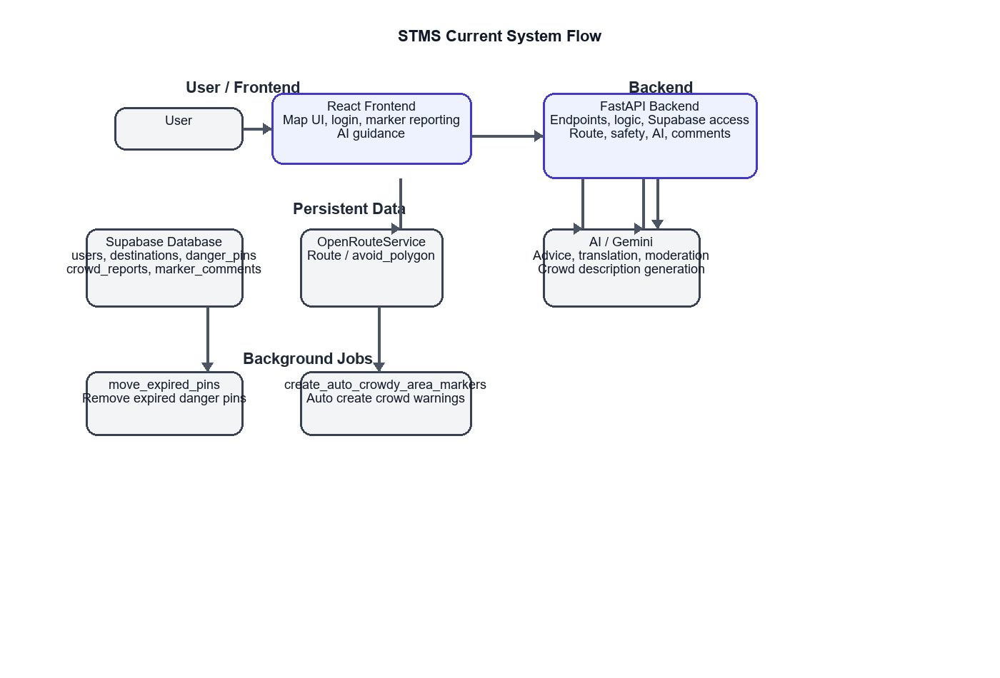

Smart Tourism Management System

Capstone title: **Design and Development of a Smart Tourism Management System with AI-Based Geolocation Guidance and Crowd Monitoring**

## What the System Can Do

This system delivers a smart tourism safety experience using map reporting, crowd-awareness, route planning, and optional AI guidance.

- User accounts and roles
  - Visitors can register, login, and delete their account.
  - Users can have administrator roles for managing destinations, markers, and reports.

- Interactive map and hazard reporting
  - Users can tap or click the map to set a location and report hazards.
  - Danger pins support type, description, severity, radius, and duration.
  - The map shows active danger zones with warning markers and alert circles.

- Crowd reporting and destination insights
  - Local admin can submit crowd-level updates for destinations.
  - The backend stores crowd reports and updates destination crowd status.
  - AI trend detection can identify rising crowd patterns.
  - The system can automatically create or extend “Crowdy Area” markers when many users are nearby.

- Safety checks and nearby warnings
  - The backend evaluates active danger pins for a user location.
  - It calculates a risk level and nearby danger details.

- Route planning with danger avoidance
  - The backend calculates walking routes through OpenRouteService.
  - When `avoid_danger=true`, it attempts to plan around active danger zones.
  - It validates returned routes against reported hazards and appends route advice.

- Marker comments and moderation
  - Users can add, edit, and delete comments on map markers.
  - Optional AI moderation can flag or remove spam/inappropriate comments.
  - Administrators can manage marker content and delete pins.

- Optional AI guidance
  - AI can generate friendly route and safety advice.
  - AI can summarize crowd or hazard status for nearby locations.
  - AI can moderate comments and translate alert text.

## Environment Variables

Required backend variables:

```bash
set SUPABASE_URL=https://your-project.supabase.co
set SUPABASE_KEY=your-service-role-key
set ORS_API_KEY=your-openrouteservice-api-key
```

Optional AI variables:

```bash
set GEMINI_API_KEY=your-gemini-api-key
# or
set GOOGLE_API_KEY=your-google-genai-api-key
```

Optional model name:

```bash
set GEMINI_MODEL=gemini-3.1-flash
```

## System Data Flow

The system is organized into three main layers:

- **Frontend React app**: the user interacts with the map, marker reporting, login, comments, and AI guidance.
- **FastAPI backend**: receives HTTP requests, enforces validation, applies safety/crowd logic, and queries Supabase.
- **External services**: Supabase stores persistent data; OpenRouteService provides route directions; Gemini/GenAI powers optional AI advice, moderation, and translation.

Key data flow paths:

- User actions in the frontend call backend endpoints such as `/safety-check`, `/route`, `/ai-advice`, `/danger-pins`, and marker comment APIs.
- The backend reads and writes to Supabase tables like `users`, `destinations`, `danger_pins`, `crowd_reports`, and `marker_comments`.
- Routes with `avoid_danger=true` use active danger pins to build `avoid_polygons`, then proxy the request to OpenRouteService.
- AI flows use optional Gemini/GenAI access to generate advice, moderate comments, translate alerts, and create crowd warning descriptions.
- Background tasks automatically expire old danger pins and generate Crowdy Area markers from recent crowd reports.



## Backend Setup

1. Open a terminal and go to the backend folder:

```bash
cd backend
```

2. Create and activate a Python virtual environment:

```bash
python -m venv venv
# Windows
venv\Scripts\activate
# macOS / Linux
# source venv/bin/activate
```

3. Install dependencies:

```bash
pip install -r requirements.txt
```

4. Configure environment variables:

```bash
set SUPABASE_URL=https://your-project.supabase.co
set SUPABASE_KEY=your-service-role-key
```

5. Start the backend API server:

```bash
uvicorn main:app --reload
```

## Frontend Setup

1. Open a new terminal and go to the frontend folder:

```bash
cd frontend
```

2. Install dependencies:

```bash
npm install
```

3. Start the frontend development server:

```bash
npm run dev
```

## User Workflow

1. Open the frontend application in your browser.
2. Click on the map to set your current or starting location.
3. Enable marker mode to report a hazard, dark area, crowded location, wildlife sighting, or other warning.
4. Add a description and place the marker on the map.
5. View nearby warnings and receive alerts if your path approaches an active danger zone.

## Notes

- The backend is Supabase-backed and stores destinations, crowd reports, danger pins, and marker comments.
- The system is designed for smart tourism guidance, crowd awareness, and local safety reporting.
- If you configure AI services, the backend can support comment moderation and alert translation.
